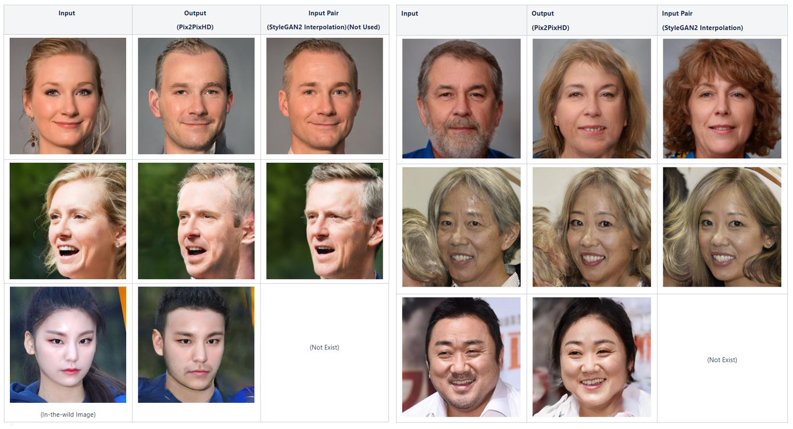
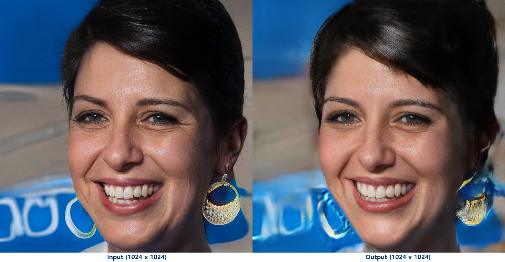

# Simple Pytorch StyleGAN2-Distillation Implementation
## Info
paper : StyleGAN2 Distillation for Feed-forward Image Manipulation (https://arxiv.org/abs/2003.03581) <br />
official release : github(https://github.com/EvgenyKashin/stylegan2-distillation)

## Environment
pytorch : 1.4.0 <br />
python : 3.7.4


## Result
Inference takes around 0.25 ~ 0.4 seconds per 1024 x 1024 size single image <br />
Result after trained on 5000 pair synthetic dataset / 150 epoch / V100 GPU <br />
###### Gender Translation Result (Female -> Male, Male -> Female)
<div align="center">
  
</div>

###### Age Translation Result (Younger)
<div align="center">
  
</div>

## Usage
###### Simple Face Classifier (Go to ./0_simple_classifier)

1) After downloading [IMDB-WIKI](https://data.vision.ee.ethz.ch/cvl/rrothe/imdb-wiki/), clean out data using this program
```
python misc_imdb_preprocessing.py
```
2) Train Simple Face Classifier
```
python all_in_one.py --attribute [gender/age] --phase train --db_root [imdb_dataset_path] 
```
3) Test Simple Face Classifier
```
python all_in_one.py --attribute [gender/age] --phase test --db_root [imdb_dataset_path]
```

<br />

###### StyleGAN2 Generator (Go to ./1_stylegan2)
After converting StyleGAN2-pytorch [checkpoint](https://github.com/rosinality/stylegan2-pytorch), run this code
1) Generate & Classify & Filter Images, then, Calculate Mean on each classes
```
python generate_distillation.py --phase set --attribute [gender/age]
```
2) [Option] Generate 5 set images using calculated mean vector
```
python generate_distillation.py --phase multiple --attribute [gender/age] 
```
3) Generate Synthetic Dataset
```
python generate_distillation.py --phase pair --attribute [gender/age] --synthetic_path [target_path]
```

<br />

###### Pix2PixHD Network (Go to ./2_pix2pixhd)
With synthetic dataset generated above, train [pix2pixhd](https://github.com/NVIDIA/pix2pixHD)
1) Train Pix2PixHD
```
python train.py --name [name] --label_nc 0 --no_instance --dataroot [synthetic data path] --reverse [False for forward, True for backward] $@
```
2) Test Pix2PixHD
```
python test.py --name [name] --reverse [False for forward, True for backward] --netG global --ngf 64 --label_nc 0 --resize_or_crop none --no_instance --dataroot [synthetic data path] --which_epoch latest
```

## Code Reference
Pytorch-StyleGAN2 code slightly changed based on [rosinality](https://github.com/rosinality/stylegan2-pytorch), 
Pytorch-Pix2PixHD code borrowed from [NVIDIA](https://github.com/NVIDIA/pix2pixHD)

## Author
[Gie-ok-Hie-ut](https://github.com/Gie-ok-Hie-ut)
